# Sequence Diagram - Agent Content Generation Platform

## Core Business Flows

```mermaid
sequenceDiagram
    participant U as User
    participant UI as Frontend(Gradio)
    participant Auth as AuthService
    participant AgentMgr as AgentManager
    participant TaskMgr as TaskManager
    participant GenEngine as GenerationEngine
    participant Dify as DifyAPI
    participant DB as Database
    participant FS as FileSystem

    %% Authentication Flow (#REF-AUTH-01)
    rect rgb(240, 240, 250)
        note over U,DB: Authentication Flow
        U->>UI: Access System
        UI->>UI: Check Session
        UI-->>U: Show Login Page
        U->>UI: Enter Password
        UI->>Auth: [POST /api/auth/login] {password}
        Auth->>Auth: Validate Password
        alt Valid Password
            Auth->>DB: Create Session
            Auth-->>UI: {token, sessionId}
            UI-->>U: Redirect to Dashboard
        else Invalid Password
            Auth-->>UI: {error: "Invalid credentials"}
            UI-->>U: Show Error Message
        end
    end

    %% Agent Configuration Flow (#REF-AGENT-01)
    rect rgb(250, 240, 240)
        note over U,Dify: Agent Configuration Flow
        U->>UI: Navigate to Agent Management
        UI->>AgentMgr: [GET /api/agents]
        AgentMgr->>DB: Query Agents
        AgentMgr-->>UI: {agents: [...]}
        UI-->>U: Display Agent List
        U->>UI: Click Add Agent
        U->>UI: Fill Agent Details
        UI->>AgentMgr: [POST /api/agents] {name, url, apiToken}
        AgentMgr->>AgentMgr: Validate Input
        AgentMgr->>Dify: [POST /api/agents/validate] Test Connection
        alt Valid API Token
            Dify-->>AgentMgr: {status: "success"}
            AgentMgr->>DB: Save Agent Config
            AgentMgr-->>UI: {agentId, status: "created"}
            UI-->>U: Show Success Message
        else Invalid API Token
            Dify-->>AgentMgr: {error: "Invalid token"}
            AgentMgr-->>UI: {error: "Validation failed"}
            UI-->>U: Show Validation Error
        end
    end

    %% Task Template Configuration (#REF-TASK-01)
    rect rgb(240, 250, 240)
        note over U,DB: Task Template Management
        U->>UI: Navigate to Tasks
        UI->>TaskMgr: [GET /api/tasks]
        TaskMgr->>DB: Query Tasks
        TaskMgr-->>UI: {tasks: [...]}
        U->>UI: Add New Task
        U->>UI: Enter Task Details
        UI->>TaskMgr: [POST /api/tasks] {name, promptTemplate}
        TaskMgr->>TaskMgr: Validate Placeholders
        alt Valid Template
            TaskMgr->>DB: Save Task Template
            TaskMgr-->>UI: {taskId, status: "created"}
            UI-->>U: Show Success
        else Invalid Placeholders
            TaskMgr-->>UI: {error: "Invalid placeholder syntax"}
            UI-->>U: Show Syntax Error
        end
    end

    %% Content Generation Flow (#REF-GEN-01)
    rect rgb(250, 250, 240)
        note over U,FS: Content Generation Flow
        U->>UI: Navigate to Generation
        UI->>AgentMgr: [GET /api/agents]
        AgentMgr-->>UI: {agents: [...]}
        UI->>TaskMgr: [GET /api/tasks]
        TaskMgr-->>UI: {tasks: [...]}
        U->>UI: Select Agent & Task
        U->>UI: Input Text Content

        opt File Upload (#REF-UPLOAD-01)
            U->>UI: Upload File
            UI->>FS: [POST /api/upload] {file}
            FS->>FS: Validate Format
            alt Supported Format
                FS->>FS: Parse Content
                FS-->>UI: {content: "...", fileId}
                UI-->>U: Display File Content
            else Unsupported Format
                FS-->>UI: {error: "Format not supported"}
                UI-->>U: Show Format Error
            end
        end

        U->>UI: Click Generate
        UI->>GenEngine: [POST /api/generation/start] {agentId, taskId, input}
        GenEngine->>DB: Get Agent Config
        GenEngine->>DB: Get Task Template
        GenEngine->>GenEngine: Merge Template + Input
        GenEngine->>Dify: [POST /chat-messages] Stream Request

        loop Streaming Response
            Dify-->>GenEngine: SSE Event {chunk}
            GenEngine->>UI: [GET /api/generation/stream] {chunk}
            UI-->>U: Display Partial Content
        end

        Dify-->>GenEngine: Stream Complete
        GenEngine->>DB: Save to History
        GenEngine-->>UI: {generationId, status: "completed"}
        UI-->>U: Show Complete Content

        opt Download Result
            U->>UI: Click Download
            UI->>GenEngine: [GET /api/generation/download/{id}]
            GenEngine->>FS: Generate Markdown File
            GenEngine-->>UI: {file: markdown}
            UI-->>U: Download File
        end
    end

    %% History Management Flow (#REF-HISTORY-01)
    rect rgb(245, 245, 255)
        note over U,DB: History Management
        U->>UI: Navigate to History
        UI->>DB: [GET /api/history] {limit: 30}
        DB-->>UI: {history: [...]}
        UI-->>U: Display History List
        U->>UI: Click History Item
        UI->>DB: [GET /api/history/{id}]
        DB-->>UI: {fullContent: "..."}
        UI-->>U: Show Full Content

        opt Export History
            U->>UI: Click Export
            UI->>FS: [GET /api/history/{id}/export]
            FS-->>UI: {file: markdown}
            UI-->>U: Download History
        end
    end

    %% Session Timeout Handling
    rect rgb(255, 240, 240)
        note over U,Auth: Session Management
        loop Every 30 minutes
            Auth->>DB: Check Session Activity
            alt Session Inactive > 30min
                Auth->>DB: Invalidate Session
                Auth->>UI: Session Expired Event
                UI-->>U: Redirect to Login
            end
        end
    end
```

## API Call Mapping to State Transitions

| API Call | Source State | Target State | Business Logic |
|---------|-------------|--------------|----------------|
| POST /api/auth/login | Unauthenticated | Authenticated | Password validation |
| POST /api/agents | NoAgents | AgentsConfigured | Agent setup |
| POST /api/tasks | NoTasks | TasksConfigured | Template creation |
| POST /api/generation/start | Ready | Generating | Content generation |
| GET /api/generation/stream | Generating | Generating/Complete | Streaming updates |
| GET /api/history | Idle | ViewingHistory | History retrieval |

## Error Handling Sequences

All API calls follow this pattern:
1. Request validation
2. Business logic execution
3. Success → State transition
4. Failure → Error response + maintain current state

## Performance Requirements
- API response time < 2s (except generation)
- Generation timeout: 100s
- Stream chunk interval: < 500ms