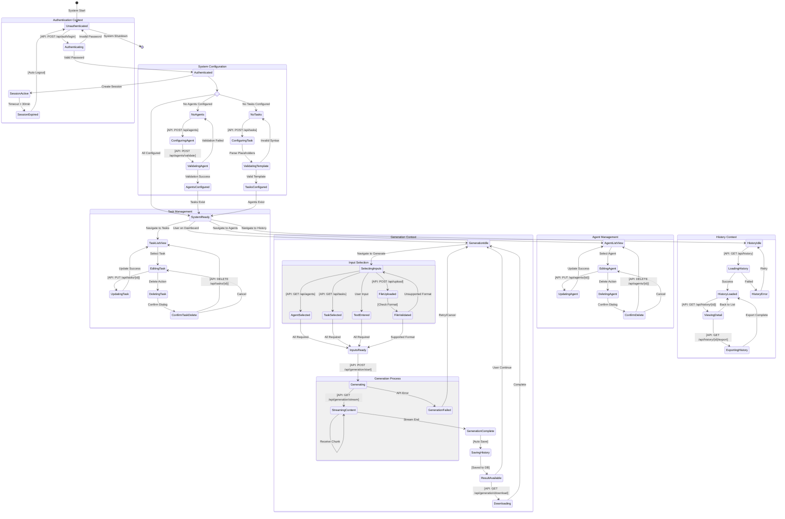

# State Diagram - Agent Content Generation Platform

## System State Machine

## State Transition Rules

### Authentication State Transitions
| Current State | Trigger | API Call | Next State | Condition |
|--------------|---------|----------|------------|-----------|
| Unauthenticated | User Access | - | Authenticating | Always |
| Authenticating | Password Submit | POST /api/auth/login | Authenticated | Valid Password |
| Authenticating | Password Submit | POST /api/auth/login | Unauthenticated | Invalid Password |
| SessionActive | Inactivity | - | SessionExpired | > 30 minutes |
| SessionExpired | Auto Action | - | Unauthenticated | Always |

### Configuration State Transitions
| Current State | Trigger | API Call | Next State | Condition |
|--------------|---------|----------|------------|-----------|
| NoAgents | Add Agent | POST /api/agents | ConfiguringAgent | User Action |
| ConfiguringAgent | Validate | POST /api/agents/validate | AgentsConfigured | Valid Token |
| NoTasks | Add Task | POST /api/tasks | ConfiguringTask | User Action |
| ConfiguringTask | Validate | - | TasksConfigured | Valid Template |

### Generation State Transitions
| Current State | Trigger | API Call | Next State | Condition |
|--------------|---------|----------|------------|-----------|
| GenerationIdle | Navigate | - | SelectingInputs | User Action |
| SelectingInputs | Select Agent | GET /api/agents | AgentSelected | Valid Selection |
| SelectingInputs | Select Task | GET /api/tasks | TaskSelected | Valid Selection |
| SelectingInputs | Input Text | - | TextEntered | Text Present |
| SelectingInputs | Upload File | POST /api/upload | FileUploaded | File Valid |
| InputsReady | Generate | POST /api/generation/start | Generating | All Required |
| Generating | Stream | GET /api/generation/stream | StreamingContent | API Success |
| StreamingContent | Complete | - | GenerationComplete | Stream End |
| GenerationComplete | Auto Save | - | SavingHistory | Always |
| ResultAvailable | Download | GET /api/generation/download | Downloading | User Action |

### History State Transitions
| Current State | Trigger | API Call | Next State | Condition |
|--------------|---------|----------|------------|-----------|
| HistoryIdle | Load | GET /api/history | LoadingHistory | User Navigate |
| LoadingHistory | Success | - | HistoryLoaded | Data Retrieved |
| HistoryLoaded | View Item | GET /api/history/{id} | ViewingDetail | Item Selected |
| ViewingDetail | Export | GET /api/history/{id}/export | ExportingHistory | User Action |

## State Invariants

1. **Authentication Invariant**: No state outside AuthContext is accessible without being Authenticated
2. **Configuration Invariant**: SystemReady requires at least one Agent AND one Task
3. **Generation Invariant**: Generating state requires valid Agent, Task, and Input
4. **History Invariant**: History operations require existing generation records

## State Persistence

States that persist across sessions:
- Agent configurations
- Task templates
- Generation history

States that are session-specific:
- Authentication status
- Current generation progress
- UI navigation state