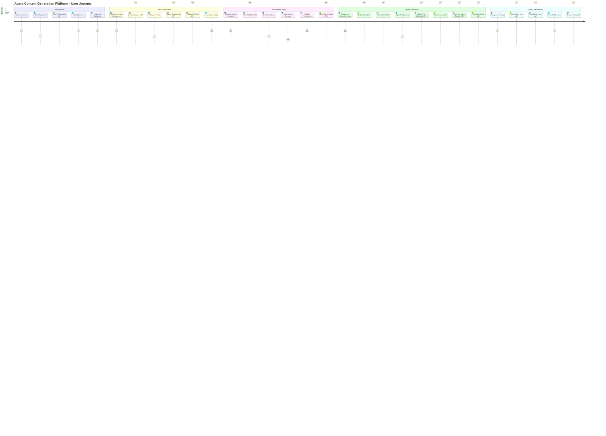

# User Journey - Agent Content Generation Platform

## Journey Overview
This user journey captures the complete flow of using the Agent Content Generation Platform from authentication to content generation and history management.

## Key Decision Points

1. **Authentication Gate** (#REF-AUTH-01)
   - Decision: Valid password?
   - Success → Dashboard
   - Failure → Error message + retry

2. **Agent Validation** (#REF-AGENT-01)
   - Decision: Valid API token?
   - Success → Save configuration
   - Failure → Show validation error

3. **Template Validation** (#REF-TASK-01)
   - Decision: Valid placeholder syntax?
   - Success → Save template
   - Failure → Show syntax error

4. **Content Generation** (#REF-GEN-01)
   - Decision: All required inputs provided?
   - Success → Start generation
   - Failure → Show missing input error

5. **File Upload** (#REF-UPLOAD-01)
   - Decision: Supported file format?
   - Success → Parse and display content
   - Failure → Show format error

## Business Logic Mapping

| Journey Step | API Endpoint | State Transition | Sequence Actor |
|-------------|--------------|------------------|----------------|
| Enter Password | POST /api/auth/login | Unauthenticated → Authenticated | User → System |
| Add Agent | POST /api/agents | NoAgents → AgentsConfigured | Admin → System |
| Add Task | POST /api/tasks | NoTasks → TasksConfigured | User → System |
| Generate Content | POST /api/generation/start | Ready → Generating | User → Dify |
| View History | GET /api/history | Idle → ViewingHistory | User → System |

## Success Metrics Alignment
- Authentication success rate > 99%
- Agent configuration success > 95%
- Content generation success > 95%
- User completes flow in < 5 minutes